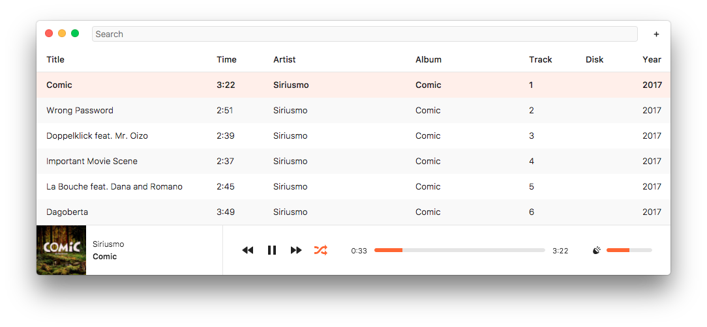
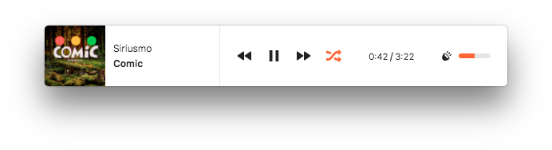

<h1 align="center">
   
  
   
  Hyperamp
</h1>

<h4 align="center">
  a humble music player
   
   
</h4>

**Hyperamp** is a project by the [hypermodules](https://hypermodul.es/) team to make a simple and free audio player that anyone can improve. We designed it to be fast and compact, with no strings attached to a store or anything else. Here's what it looks like:

Mac/Linux | Windows | Version | IRC | Deps | Dev Deps
--------- | ------- | ------- | --- | ---- | --------
[![build][build-img]][build-url] | [![appveyor-status][appveyor-img]][appveyor-url] |  [![stability][stability-img]][stability-url] | [![irc][irc-img]][irc-url] |  | 

## Download

See the [releases](https://github.com/hypermodules/hyperamp/releases) page to download the latest version for your platform.

## Contributing

Want to help make Hyperamp better? Great! Head over to the [contributing guidelines](CONTRIBUTING.md) to get started.

## License

© [HYPERMODULES LLC](https://hypermodul.es)
[GPLv3](LICENSE.md)

[stability-img]: https://img.shields.io/badge/stability-experimental-orange.svg
[stability-url]: https://nodejs.org/api/documentation.html#documentation_stability_index
[build-img]: https://img.shields.io/travis/hypermodules/hyperamp/master.svg
[build-url]: https://travis-ci.org/hypermodules/hyperamp
[standard-img]: https://img.shields.io/badge/code%20style-standard-brightgreen.svg
[standard-url]: https://github.com/feross/standard
[appveyor-img]: https://ci.appveyor.com/api/projects/status/so74ca9bg452qpny/branch/master?svg=true
[appveyor-url]: https://ci.appveyor.com/project/bcomnes/hyperamp/branch/master
[irc-url]: https://www.irccloud.com/invite?channel=%23hypermodules&amp;hostname=irc.freenode.net&amp;port=6697&amp;ssl=1
[irc-img]: https://img.shields.io/badge/freenode-%23hypermodules-1e72ff.svg
