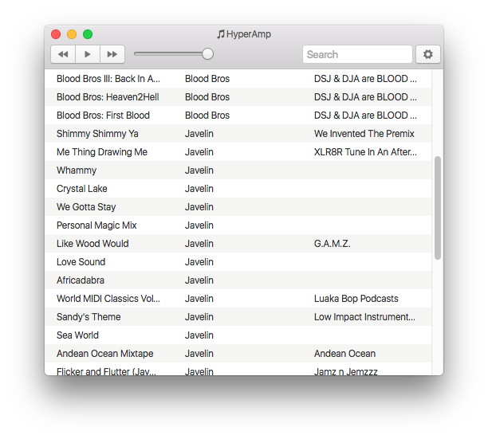

# HyperAmp

Experimental desktop audio player and library.

Work in progress.

**:warning: This is pre-alpha! :warning:️**

Only worth forking if you want to contribute to development!

This project adheres to the [Module Utopia Contract](https://module.party) for installing, testing, and running the program:

```
npm install
npm test
npm start
```

We're using [electron](https://github.com/electron/electron) and [choo](https://github.com/yoshuawuyts/choo) under the hood.

## Screenshot



## License

[ISC](license.md)
