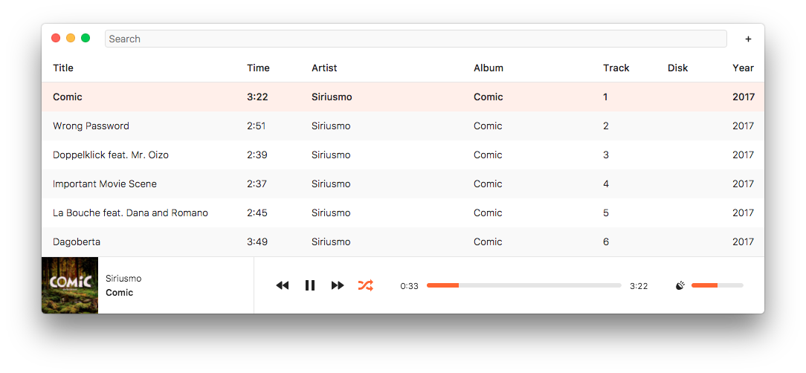
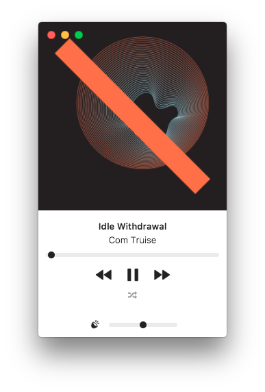

Experimental audio player built with web technologies ([choo](https://github.com/yoshuawuyts/choo) + [electron](https://github.com/electron/electron)).

macOS/Linux  | Windows      | Version     | IRC
-------------- | ------------ | ------------| ---
[![build][build-img]][build-url] | [![appveyor-status][appveyor-img]][appveyor-url] |  [![stability][stability-img]][stability-url] | [![irc][irc-img]][irc-url]

## Install

This project is a [module party](http://module.party).

```
npm install
npm test
npm start
```

Currently under active development. macOS build coming soon!

## Screenshots

<div align="center">




</div>

## License

[ISC](license.md)

[stability-img]: https://img.shields.io/badge/stability-experimental-orange.svg
[stability-url]: https://nodejs.org/api/documentation.html#documentation_stability_index
[build-img]: https://img.shields.io/travis/hypermodules/hyperamp/master.svg
[build-url]: https://travis-ci.org/hypermodules/hyperamp
[standard-img]: https://img.shields.io/badge/code%20style-standard-brightgreen.svg
[standard-url]: https://github.com/feross/standard
[appveyor-img]: https://ci.appveyor.com/api/projects/status/34x775v3nly2ml2b?svg=true
[appveyor-url]: https://ci.appveyor.com/project/bcomnes/hyperamp
[irc-url]: https://www.irccloud.com/invite?channel=%23hypermodules&amp;hostname=irc.freenode.net&amp;port=6697&amp;ssl=1
[irc-img]: https://img.shields.io/badge/freenode-%23hypermodules-1e72ff.svg
