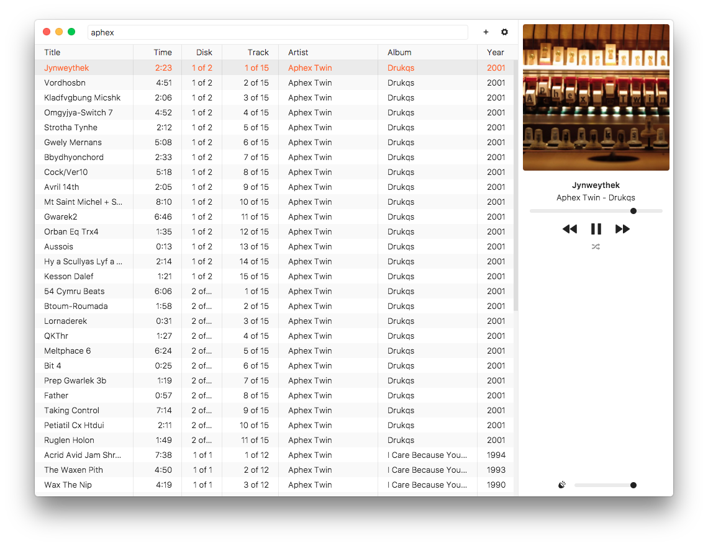

# HyperAmp [![stability][stability-img]][stability-url] [![build][build-img]][build-url] [![appveyor-status][appveyor-img]][appveyor-url]

[stability-img]: https://img.shields.io/badge/stability-experimental-orange.svg
[stability-url]: https://nodejs.org/api/documentation.html#documentation_stability_index
[build-img]: https://img.shields.io/travis/hypermodules/hyperamp/master.svg
[build-url]: https://travis-ci.org/hypermodules/hyperamp
[standard-img]: https://img.shields.io/badge/code%20style-standard-brightgreen.svg
[standard-url]: https://github.com/feross/standard
[appveyor-img]: https://ci.appveyor.com/api/projects/status/ajdq0to9sk4ahexa?svg=true&&style=flat-square
[appveyor-url]: https://ci.appveyor.com/project/bcomnes/hyperamp

Experimental audio player built with web technologies ([choo](https://github.com/yoshuawuyts/choo) + [electron](https://github.com/electron/electron)).

## Install

This project adheres to the [Contract of the Module United Nations](http://module.party).

```
npm install
npm test
npm start
```

## Screenshot



## License

[ISC](license.md)
